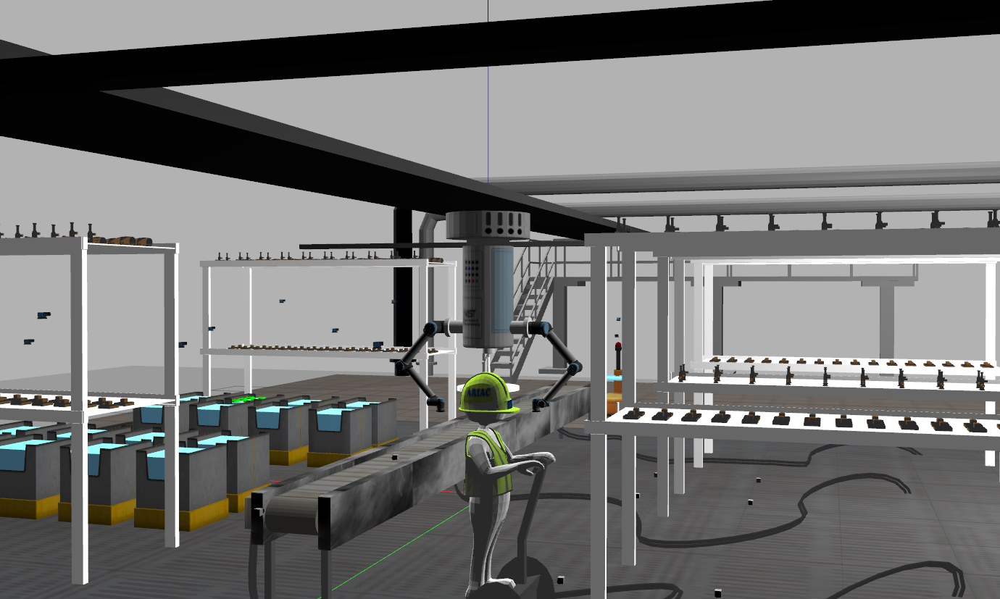
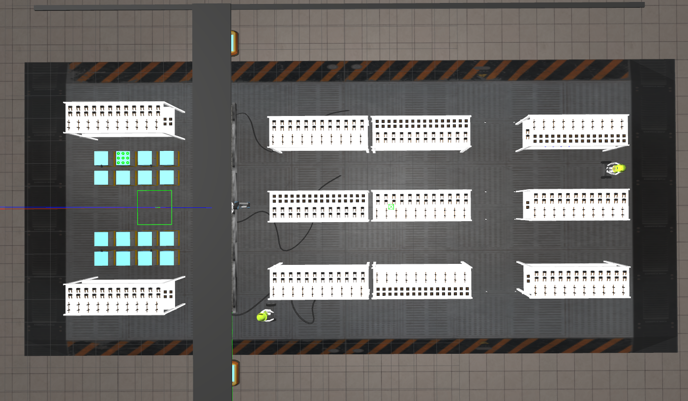
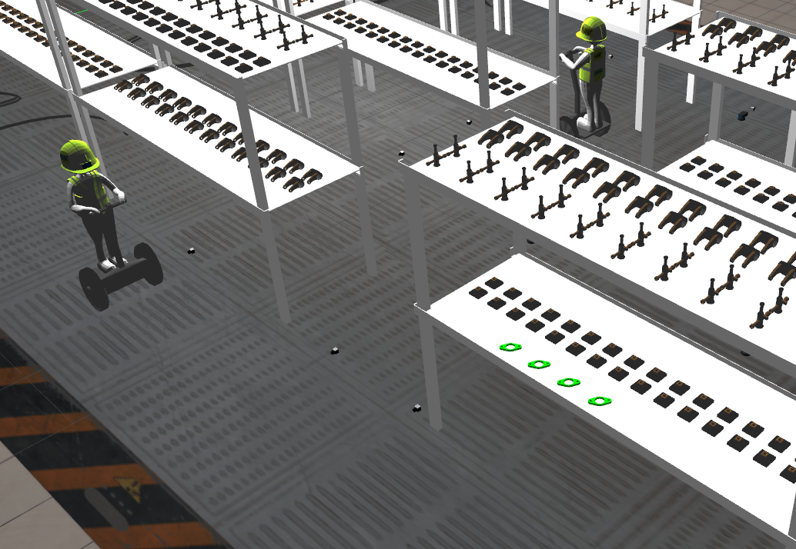
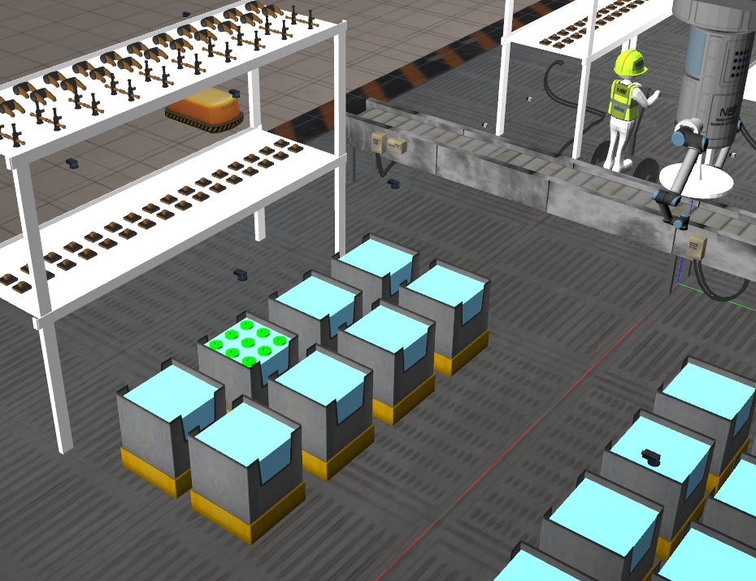
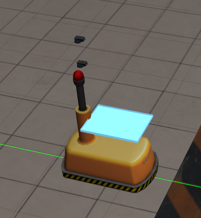
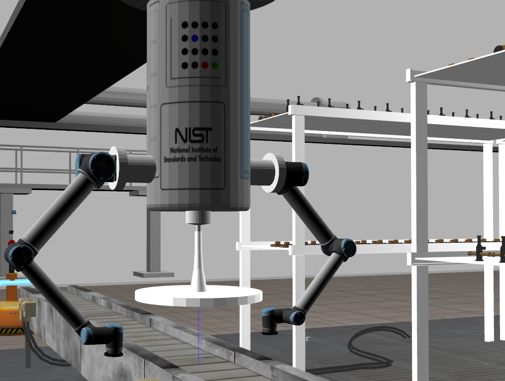
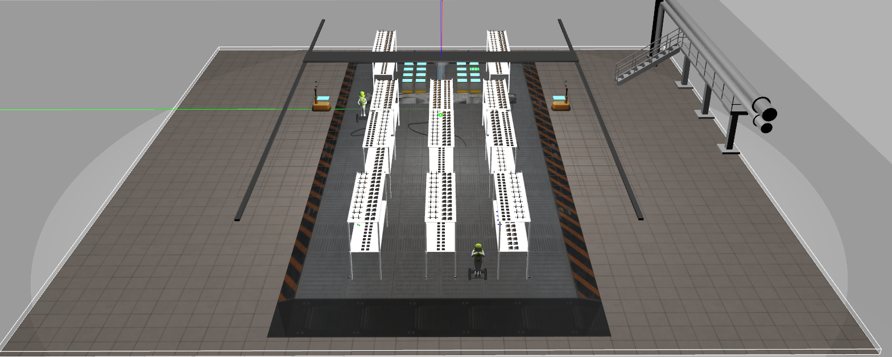

# ARIAC Competition

Picking and delivering parts in an industrial environment with faulty parts/faulty gripper/sensor blackout/moving obstacles

## Team members
1. Govind Ajith Kumar
2. Rajesh NS
3. Pradeep Gopal
4. Dakota Abernathy
5. Cheng Chen

## Images

  

  

  

  

  

  

  

## Steps to Run the package

Install Ariac package in your workspace using the steps mentioned in the following link

[Ariac Installation Instructions](https://github.com/usnistgov/ARIAC/blob/master/wiki/tutorials/installation.md)

Follow these instructions to run the package after installing ARIAC

1. Copy the package and paste it in /ariac_ws/src
2. Open a terminal and type the following commands
3. cd /ariac_ws
4. catkin build final-group1 
5. source devel/setup.bash
6. roslaunch final-group1 final.launch load_moveit:=true

Wait till the terminal says "you can start planning now"

7. Open a new terminal and enter the following command to run the node.
8. cd /ariac_ws
9. source devel/setup.bash
10. rosrun final-group1 final_node

## Steps to view the Doxygen report

Open the index.html file present in "/ariac_ws/src/final-group1/Doxygen_report/html/index.html"

